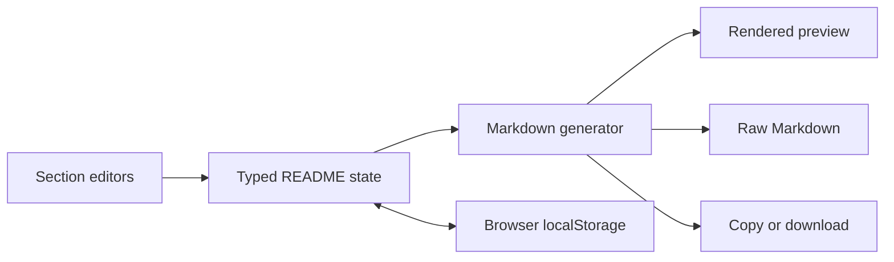

<div align="center">

# ⚒️ ReadmeForge

**Design your GitHub profile README visually. Preview it live. Ship it in one click.**

[](https://nextjs.org)
[](https://www.typescriptlang.org)
[](https://tailwindcss.com)
[](https://zustand-demo.pmnd.rs)
[](https://vercel.com/new)
[](./LICENSE)

[Run locally](#getting-started) · [Report a Bug](https://github.com/K1NG9035/ReadmeForge/issues) · [Request a Feature](https://github.com/K1NG9035/ReadmeForge/issues/new)

</div>

---

## ✨ What is ReadmeForge?

ReadmeForge is a browser-based builder for GitHub profile `README.md` files. Edit profile sections on the left and see a GitHub-style rendering update on the right. When you're happy with it, copy the Markdown or download `README.md` and add it to a public repository named after your GitHub username.

There is no account or app backend. Your edits are saved in this browser's `localStorage`; the app generates the Markdown locally. Optional badges, typing animations, and stats cards in the exported README load from their public image services when someone views your profile.

## How It Works

1. Choose **Minimal**, **Showcase**, or **Detailed**, or start with the saved README.
2. Edit a section. The form updates the typed Zustand state as you work.
3. `generateMarkdown(state)` turns that state into Markdown. The preview and Raw Markdown tab use the same generated string.
4. Copy the Markdown or download it as `README.md`, then place it in your `username/username` GitHub repository.



### Example Output

The Minimal template starts with a centered introduction, an About section, and selected technology badges. The generated result is ordinary Markdown with a small amount of HTML for alignment:

```md
<div align="center">
<h1 align="center">Alex Morgan</h1>
<p align="center">Software developer building useful things.</p>
</div>

## About Me

- 🌱 Currently learning something new every day.

## Tech Stack

  
```

## 🚀 Features

| Section | What you can do |
| --- | --- |
| **Header** | Name, subtitle, animated typing text (README Typing SVG), optional banner image |
| **About Me** | Add, edit, and remove emoji-prefixed bullet points |
| **Tech Stack** | Search a categorized badge grid (Languages, Frameworks, Cloud, Databases, Tools) powered by shields.io |
| **GitHub Stats** | Stats card, streak stats, top languages, trophies, with `dark`, `light`, `nord` and `dracula` themes |
| **Social & Contact** | Twitter/X, LinkedIn, YouTube, Discord and Portfolio badges with custom URLs |
| **Support Me** | Buy Me a Coffee, Patreon and Ko-fi links |

**Workspace**

- 🪟 Split-screen editor with a collapsible accordion form (mobile friendly)
- 👀 Two preview modes: rendered **Preview** (GFM + raw HTML) and syntax-highlighted **Raw Markdown**
- 🧩 Templates: **Minimal**, **Showcase** and **Detailed**
- 📋 One-click **Copy Markdown** with toast feedback
- ⬇️ **Download README.md**
- 🌗 Dark / Light mode, persisted across sessions
- 💾 Auto-save, so your work survives a refresh

## 🧱 Tech Stack

- **Framework:** Next.js (App Router) + React + TypeScript (strict, no `any`)
- **Styling:** Tailwind CSS (class-based dark mode) + shadcn/ui
- **Icons:** Lucide React
- **State:** Zustand with `persist` middleware
- **Rendering:** `react-markdown` + `remark-gfm` + `rehype-raw` + `rehype-sanitize`
- **Raw Markdown:** `react-syntax-highlighter`

## 🗂️ Project Structure

```
readmeforge/
├── app/
│   ├── layout.tsx
│   ├── page.tsx
│   └── globals.css
├── components/
│   ├── ui/                    # shadcn/ui primitives
│   ├── sections/
│   │   ├── HeaderEditor.tsx
│   │   ├── AboutEditor.tsx
│   │   ├── TechStackEditor.tsx
│   │   ├── StatsEditor.tsx
│   │   ├── SocialEditor.tsx
│   │   └── SupportEditor.tsx
│   ├── ActionBar.tsx
│   ├── EditorPane.tsx
│   ├── PreviewPane.tsx
│   └── ReadmeForgeApp.tsx
├── hooks/
│   └── useHydrated.ts          # prevent persisted-state hydration mismatch
├── lib/
│   ├── markdown-generator.ts  # pure: state in, Markdown string out
│   ├── badges.ts              # badge catalog (name, color, logo)
│   └── templates.ts           # Minimal / Showcase / Detailed presets
├── store/
│   └── readmeStore.ts         # Zustand store + persist
├── types/
│   └── readme.ts              # strict types for every README section
└── README.md
```

**Design principle:** the store's shape maps directly onto `types/readme.ts`, and `generateMarkdown(state)` is a pure function, so there is no transformation layer and the generator is trivially testable.

## 🏁 Getting Started

### Prerequisites

- Node.js **20.9+** (20 LTS or newer)
- npm, pnpm or yarn

### Install and run

```bash
git clone https://github.com/K1NG9035/ReadmeForge.git
cd ReadmeForge
npm install
npm run dev
```

Open [http://localhost:3000](http://localhost:3000).

### Scripts

| Command | Description |
| --- | --- |
| `npm run dev` | Start the dev server |
| `npm run build` | Create a production build |
| `npm run start` | Serve the production build |
| `npm run lint` | Lint the codebase |
| `npm run typecheck` | Run `tsc --noEmit` |
| `npm test` | Run unit tests (markdown generator) |

## ☁️ Deployment

ReadmeForge is a fully client-side app, so it deploys anywhere that serves a Next.js app or static files.

### Option 1: Vercel (recommended)

1. Push the repo to GitHub.
2. Go to [vercel.com/new](https://vercel.com/new) and import the repository.
3. Keep the defaults (framework preset: **Next.js**) and click **Deploy**.

No environment variables are required.

### Option 2: Netlify

1. Import the repo at [app.netlify.com](https://app.netlify.com).
2. Build command: `npm run build`
3. Publish directory: `.next` (Netlify's Next.js runtime is applied automatically).

### Option 3: Static export (GitHub Pages, Cloudflare Pages, S3, any static host)

Since there is no backend, you can export plain static files.

1. In `next.config.ts` (or `.mjs`), enable static export:

   ```ts
   import type { NextConfig } from "next";

   const nextConfig: NextConfig = {
     output: "export",
     images: { unoptimized: true },
     // For GitHub Pages under /repo-name, also set:
     // basePath: "/readmeforge",
   };

   export default nextConfig;
   ```

2. Build:

   ```bash
   npm run build
   ```

   The static site is generated in the `out/` directory.

3. Upload `out/` to your host. For GitHub Pages, publish it with a GitHub Actions workflow or the `gh-pages` branch.

### Option 4: Docker

The included `Dockerfile` uses Node 20 Alpine and separate dependency, build, and runtime stages.

```bash
docker build -t readmeforge .
docker run --rm -p 3000:3000 readmeforge
```

### Pre-deploy checklist

- [ ] `npm run typecheck` passes
- [ ] `npm run lint` passes
- [ ] `npm run build` succeeds locally
- [ ] Dark/light toggle and template switching work after a hard refresh
- [ ] Copy and Download output a valid `README.md`

## 📖 How to Use Your Generated README

1. Create a **public** repository named exactly like your GitHub username (`your-username/your-username`).
2. Choose a template, then fill in each section.
3. Click **Copy Markdown** or **Download README.md**.
4. Paste or upload it as `README.md` in that repository. It appears on your profile instantly.

## 🔌 External Services

Generated READMEs embed images from public services. They load at view time on GitHub, not inside this app's server:

- [shields.io](https://shields.io): badges
- [readme-typing-svg](https://github.com/DenverCoder1/readme-typing-svg): animated typing header
- [github-readme-stats](https://github.com/anuraghazra/github-readme-stats): stats and top languages
- [github-readme-streak-stats](https://github.com/DenverCoder1/github-readme-streak-stats): streak card
- [github-profile-trophy](https://github.com/ryo-ma/github-profile-trophy): trophies

The public `github-readme-stats` instance can be rate limited. If your cards fail to load, self-host it on Vercel and swap the base URL in `lib/markdown-generator.ts`.

## 🗺️ Roadmap

- [ ] Drag-and-drop section reordering
- [ ] Import an existing README
- [ ] Custom section blocks (projects, blog posts, quotes)
- [ ] Shareable template links
- [ ] More stats themes and badge styles

## 🤝 Contributing

Contributions are welcome.

1. Fork the repo
2. Create a branch: `git checkout -b feat/amazing-feature`
3. Commit: `git commit -m "feat: add amazing feature"`
4. Push: `git push origin feat/amazing-feature`
5. Open a Pull Request

## 📄 License

Distributed under the MIT License. See [`LICENSE`](./LICENSE) for details.

---

<div align="center">

Built with ☕ and TypeScript. If ReadmeForge helped you, give it a ⭐

</div>
